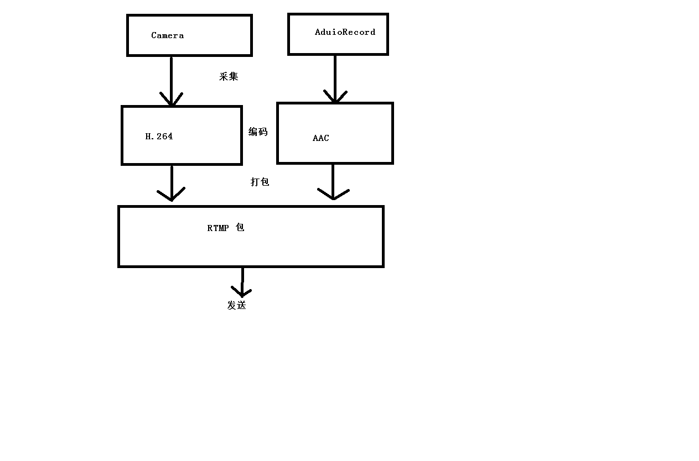

一个Android移动端音视频推流器，用于学习使用NDK技术把音视频流推送到流媒体服务器。

## 流程

### 视频编码

H.264编码使用x264库，编译x264详见：[RTMP、X264与交叉编译](notes/RTMP、X264与交叉编译.md)

1. 使用Java层的camera来采集视频数据（NV21格式）
2. 将NV21转为I420，关于NV21格式与I420格式详见：[NV21与I420](notes/NV21与I420.md)
3. 打包发送数据

### RTMP通信

RTMP通信使用[RTMPDump](http://rtmpdump.mplayerhq.hu/)，编译[RTMPDump](http://rtmpdump.mplayerhq.hu/)详见：[RTMP、X264与交叉编译](notes/RTMP、X264与交叉编译.md)，RTMP服务器搭建详见：[Nginx-RTMP](notes/Nginx-RTMP.md)

### 音频编码

音频编码使用FAAC，编译流程详见：[推流音频](notes/推流音频.md)

1. 使用AudioRecord采集pcm数据，代码见：com.dongnao.pusher.live.channel.AudioChannel.java
2. 调用faac编码，代码详见：dnpusher\app\src\main\cpp\AudioChannel::encodeData
3. 打包发送数据