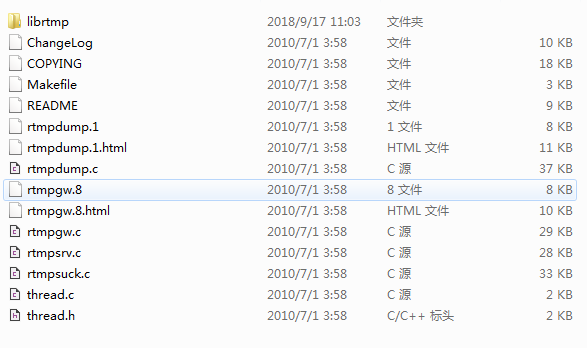
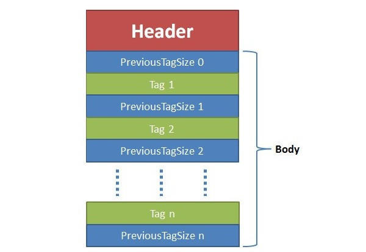
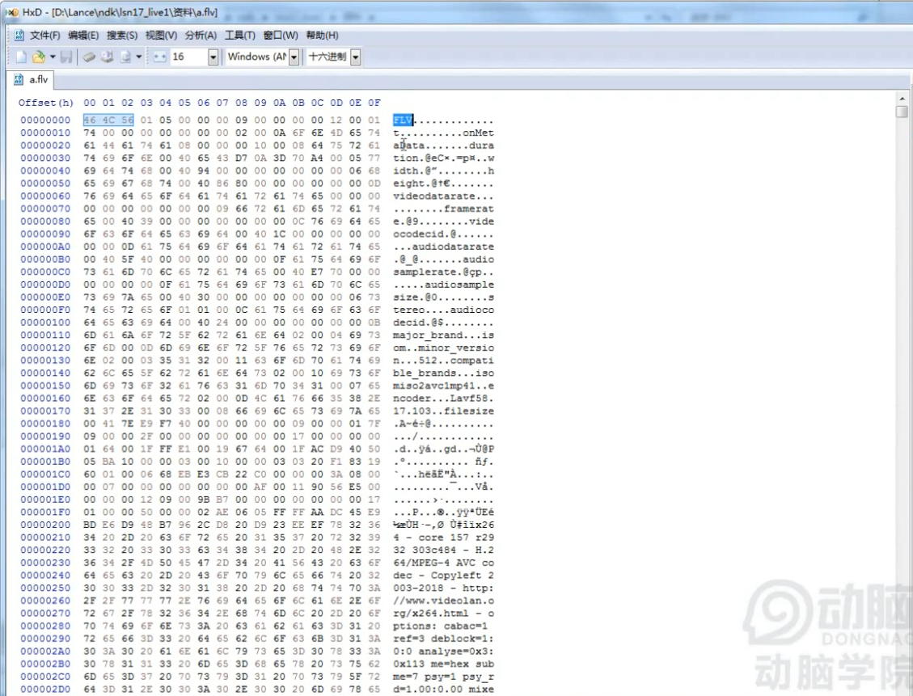
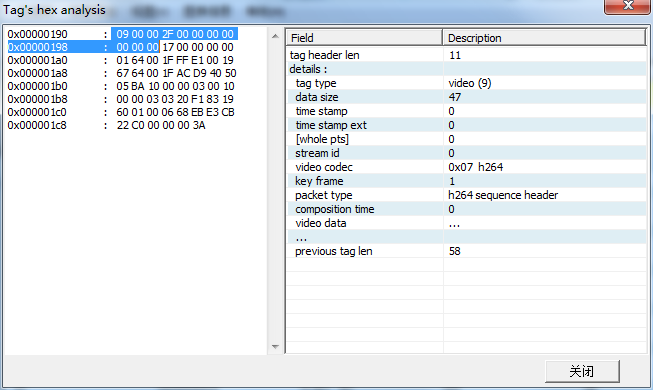
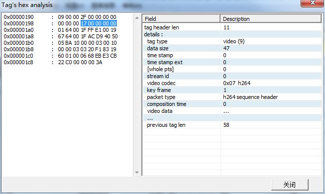
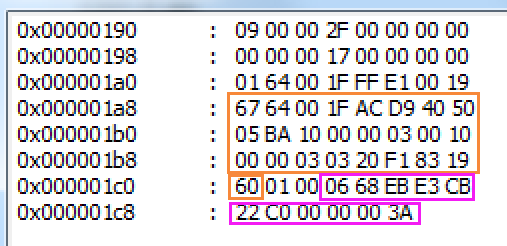
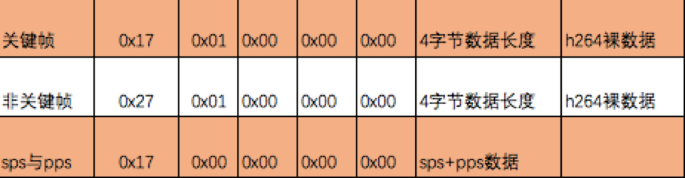
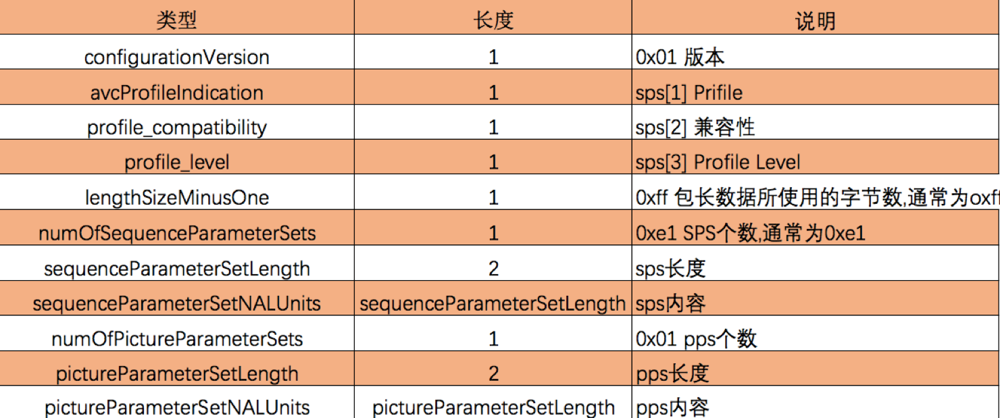
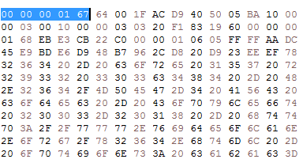

# RTMP、X264与交叉编译

[TOC]

​	与HTTP(超文本传输协议)同样是一个基于TCP的Real Time Messaging Protocol（实时消息传输协议）。由Adobe Systems公司为Flash播放器和服务器之间音频、视频和数据传输开发的一种开放协议 。在国内被广泛的应用于直播领域。HTTP默认端口为80，RTMP则为1935。

​	本质上我们通过阅读Adobe的协议规范，通过与服务器建立TCP通信，根据协议格式生成与解析数据即可使用RTMP进行直播。当然我们也可以借助一些实现了RTMP协议的开源库来完成这一过程。


## RTMPDump

​	[RTMPDump](http://rtmpdump.mplayerhq.hu/) 是一个用来处理RTMP流媒体的开源工具包。它能够单独使用进行RTMP的通信，也可以集成到FFmpeg中通过FFmpeg接口来使用RTMPDump。

​	RTMPDump源码下载：http://rtmpdump.mplayerhq.hu/download/rtmpdump-2.3.tgz

```shell
wget http://rtmpdump.mplayerhq.hu/download/rtmpdump-2.3.tgz
tar xzvf rtmpdump-2.3.tgz
```

### 集成到Android项目

​	在Android中可以直接借助NDK在JNI层调用RTMPDump来完成RTMP通信。但是首先必须得进行交叉编译。

RTMPDump源码结构如下：



​	在根目录下提供了一个`Makefile`与一些`.c`源文件。这里的源文件将会编译出一系列的可执行文件。然而我们需要的并不是可执行文件，真正的对RTMP的实现都在librtmp子目录中。在这个子目录中同样包含了一个`Makefile`文件。通过阅读`Makefile`发现，它的源码并不多:`OBJS=rtmp.o log.o amf.o hashswf.o parseurl.o`。因此我们不进行预编译，即直接放入AS中借助`CMakeLists.txt`来进行编译。这么做可以让我们方便的对库本身进行调试或修改(实际上我们确实会稍微修改这个库的源码)。

```bash
cd rtmpdump-2.3/
zip -q librtmp.zip ./librtmp/*
sz librtmp.zip
```

​	在AS中复制librtmp置于:`src/main/cpp/librtmp`，并为其编写CMakeLists.txt

```cmake
# src/main/cpp/librtmp/CMakeLists.txt
cmake_minimum_required(VERSION 3.4.1)
#预编译宏，定义宏变量：NO_CRYPTO，为的是不使用加密，因为我们没有引入OpenSSL库。可以尝试在代码里注释看不加这一行会有什么效果
set(CMAKE_C_FLAGS "${CMAKE_C_FLAGS} -DNO_CRYPTO")
#所有源文件放入 rtmp_source 变量
file(GLOB rtmp_source *.c)
#编译静态库
add_library(rtmp STATIC ${rtmp_source})
#add_library(rtmp STATIC amf.c hashswf.c log.c parseurl.c rtmp.c)
```

在`app/CMakeLists.txt`中导入这个CMakeLists.txt

```cmake
# \app\CMakeLists.txt
cmake_minimum_required(VERSION 3.4.1)
# 引入子目录
add_subdirectory(src/main/cpp/librtmp)
add_library(native-lib SHARED src/main/cpp/native-lib.cpp)
#XXX需要链接rtmp库
target_link_libraries(native-lib rtmp)
```


## RTMP视频数据

​	RTMP视频流格式与FLV很相似，通过查看FLV的格式文档，就能够知道RTMP视频数据应该怎么拼接。

RTMP中的数据就是由FLV的TAG中的数据区构成。     

   

flv文件16进制文件查看器

46 4C 56：flv的描述信息



### FLV tags 结构 

------

| 字段     | 字节 | 描述                                                         |
| -------- | ---- | ------------------------------------------------------------ |
| 类型     | 1    | 0x08: 音频<br>**0x09**: 视频<br>0x12: 脚本(描述信息)         |
| 数据大小 | 3    | 数据区的大小，不包括包头。（00 00 2F）                       |
| 时间戳   | 3    | 当前帧相对时间戳，单位是毫秒。相对于第一个TAG时戳。(00 00 00) |
| 时戳扩展 | 1    | 如果时戳大于0xFFFFFF，将会存在字节。(00)                     |
| 流ID     | 3    | 总是0(00 00 00)                                              |
| 数据区   | n    | 音、视频包                                                   |



#### 视频数据

| 字段     | 占位           | 描述                                 |
| -------- | -------------- | ------------------------------------ |
| 帧类型   | 4(例子中：1)   | **1: 关键帧**<br>2: 普通帧<br>...... |
| 编码ID   | 4（例子中：7） | **7**:  高级视频编码 AVC<br>......   |
| 视频数据 | n              | AVC则需要下面的AVCVIDEOPACKET        |

AVCVIDEOPACKET


| 字段     | 字节          | 描述                                                         |
| -------- | ------------- | ------------------------------------------------------------ |
| 类型     | 1（00）       | **0**：AVC 序列头(指导播放器如何解码)<br>1：其他单元(其他NALU) |
| 合成时间 | 3（00 00 00） | **对于AVC,全为0**                                            |
| 数据     | n             | 类型不同，数据不同                                           |

 

##### AVC 序列头

​	在AVCVIDEOPACKET 中如果类型为0，则后续数据为：

| 类型                     | 字节          | 说明                                                         |
| ------------------------ | ------------- | ------------------------------------------------------------ |
| 版本                     | 1（01）       | **0x01**                                                     |
| 编码规格                 | 3（64 00 1F） | sps[1]+sps[2]+sps[3] (后面说明)                              |
| 几个字节表示 NALU 的长度 | 1（FF）       | **0xFF**，包长为 （0xFF& 3） + 1，也就是4字节表示            |
| SPS个数                  | 1（E1）       | **0xE1**，个数为0xE1 & 0x1F 也就是1                          |
| SPS长度                  | 2             | 整个sps的长度，例子中是：0X0019，对应十进制是：25，所以往后数25个字节就是整个sps |
| sps的内容                | n             | 整个sps（0x67到0x60）                                        |
| pps个数                  | 1             | 0x01，不用计算就是1                                          |
| pps长度                  | 2             | 整个pps长度（00 06，对应的十进制是：6）                      |
| pps内容                  | n             | 整个pps内容（就是06后面的6个字节：68 EB E3 CB 22 C0）        |




##### 其他

​	在AVCVIDEOPACKET 中如果类型为1，则后续数据为：

| 类型 | 字节               | 说明      |
| ---- | ------------------ | --------- |
| 包长 | 由AVC 序列头中定义 | 后续长度  |
| 数据 | n                  | H.264数据 |


一般情况下，组装的RTMPPacket(RTMPDump中的结构体)为：







## x264

​	x264是一个C语言编写的目前对H.264标准支持最完善的编解码库。与RTMPDump一样同样直接在Android中使用，也可以集成进入FFMpeg。

https://www.videolan.org/developers/x264.html

在linux下载编译：

​	wget ftp://ftp.videolan.org/pub/x264/snapshots/last_x264.tar.bz2

### 交叉编译

​	在Android中使用x264，首先需要预编译出x264的静/动态库

```shell
#!/bin/bash
# build.sh
PREFIX=./android/armeabi-v7a
NDK_ROOT=/root/android-ndk-r17c
TOOLCHAIN=$NDK_ROOT/toolchains/arm-linux-androideabi-4.9/prebuilt/linux-x86_64

FLAGS="-isysroot $NDK_ROOT/sysroot -isystem $NDK_ROOT/sysroot/usr/include/arm-linux-androideabi -D__ANDROID_API__=17 -g -DANDROID -ffunction-sections -funwind-tables -fstack-protector-strong -no-canonical-prefixes -march=armv7-a -mfloat-abi=softfp -mfpu=vfpv3-d16 -mthumb -Wa,--noexecstack -Wformat -Werror=format-security  -O0 -fPIC"
#--disable-cli 不需要命令行工具
#--enable-static 静态库
#和ffmpeg差不多
./configure \
--prefix=$PREFIX \
--disable-cli \
--enable-static \
--enable-pic \
--host=arm-linux \
--cross-prefix=$TOOLCHAIN/bin/arm-linux-androideabi- \
--sysroot=$NDK_ROOT/platforms/android-17/arch-arm \
--extra-cflags="$FLAGS"

make clean
make install
```

#### 交叉编译遇到的问题：

##### 	缺少nasm

> 解决：下载源码编译nasm，因为apt安装的版本较低
>
> wget https://www.nasm.us/pub/nasm/releasebuilds/2.13.03/nasm-2.13.03.tar.gz
> tar xvf nasm-2.13.03.tar.gz
> cd nasm-2.13.03
> ./configure
> make && sudo make install

##### 兼容Android17的问题

> 编译x264我们需要注意一点，x264在进行环境检测的时候，使用的是比较宽松的方式，对于我们目前需要编译的android-17为目标来说，编译出的库在使用上会出现问题（对于18以上不会）。`(为什么有问题，录了小视频)`
>
> 我们需要修改`configure`脚本，在脚本中搜索`cc_check`
>
> vim如何搜索：在vim里底线命令模式，输入 /cc_check
>
> ```shell
> cc_check() {
> 	......
>  	if [ $compiler_style = MS ]; then
>         cc_cmd="$CC conftest.c -Werror=implicit-function-declaration  $(cc_cflags $CFLAGS $CHECK_CFLAGS $2) -link $(cl_ldflags $2 $LDFLAGSCLI $LDFLAGS)"
>     else
>         cc_cmd="$CC conftest.c -Werror=implicit-function-declaration  $CFLAGS $CHECK_CFLAGS $2 $LDFLAGSCLI $LDFLAGS -o conftest"
>  	fi
> 	......
> }  
> ```
>
> 向`cc_cmd`内（两处）添加 `-Werror=implicit-function-declaration` 。
>

### 集成到Android

```bash
cd ./x264-master/android
zip -q -r libx264.zip armeabi-v7a/
sz libx264.zip
```

1. 解压libx264.zip；
2. 将include文件夹拷贝到src/main/cpp/文件夹中；
3. 将lib/libx264.a拷贝到src/main/cpp/libs/armeabi-v7a中
4. 修改CMakeLists.txt

```cmake
# \app\CMakeLists.txt
add_library(native-lib SHARED src/main/cpp/native-lib.cpp)
include_directories(src/main/cpp/include)
set(CMAKE_CXX_FLAGS "${CMAKE_CXX_FLAGS} -L${CMAKE_SOURCE_DIR}/src/main/cpp/libs/${ANDROID_ABI}")
#native-lib链接rtmp库、x264库、log库
target_link_libraries(
        native-lib
        rtmp
        x264
        log)
```

5. make project，OK！

### NALU

​	NALU就是NAL UNIT，nal单元。NAL全称Network Abstract Layer, 即网络抽象层，H.264在网络上传输的结构。一帧图片经过 H.264 编码器之后，就被编码为一个或多个片（slice），而装载着这些片（slice）的载体，就是 NALU 了 。

​	我们通过x264编码获得一组或者多组 `x264_nal_t`。结合RTMP，我们需要区分的是SPS、PPS、关键帧与普通帧：

```c
enum nal_unit_type_e
{
    NAL_UNKNOWN     = 0,
    NAL_SLICE       = 1,
    NAL_SLICE_DPA   = 2,
    NAL_SLICE_DPB   = 3,
    NAL_SLICE_DPC   = 4,
    NAL_SLICE_IDR   = 5,    /* ref_idc != 0 */ 		//关键帧片
    NAL_SEI         = 6,    /* ref_idc == 0 */
    NAL_SPS         = 7,					 	  //sps片
    NAL_PPS         = 8,						  //pps片
    NAL_AUD         = 9,
    NAL_FILLER      = 12,
    /* ref_idc == 0 for 6,9,10,11,12 */
};
```

### IDR

​	一段h264视频由N组GOP（group of picture）组成，GOP指的就是画面组，一个GOP是一组连续的画面 。之前的学习中我们知道I帧能够独立解码，而P、B需要参考其他帧。

​	属于I帧的子集，有一种特殊的I帧，被称之为IDR帧，IDR帧的作用为即时刷新。


上面的这张图片描述的是2组GOP。其他I帧与IDR帧的区别就在于：刷新。当解码器解码帧5的时候，可以跨过帧4参考到帧3，普通I帧不会导致解码器的解码信息数据刷新。而IDR帧则会刷新解码需要的SPS、PPS数据，所以帧8不可能跨帧7参考解码。


### H.264数据

往RTMP包中填充的是H.264数据，但不是直接将x264编码出来的数据填充进去。

一段包含了N个图像的H.264裸数据，每个NAL之间由：

​	00 00 00 01 或者 00 00 01

进行分割。在分割符之后的第一个字节，就是表示这个nal的类型。

0x67：sps 0x68:pps 0x65:IDR

即为上面的 

NAL_SLICE_IDR   	0x65& 0x1f = 5  

NAL_SPS       		0x67 & 0x1f  = 7,					 	
NAL_PPS       		0x68  & 0x1f= 8,

在将数据加入RTMPPacket的时候是需要去除分割符的。



## 工具软件

hex.zip：十六进制查看器

flvAnalyser：flv格式的分析器